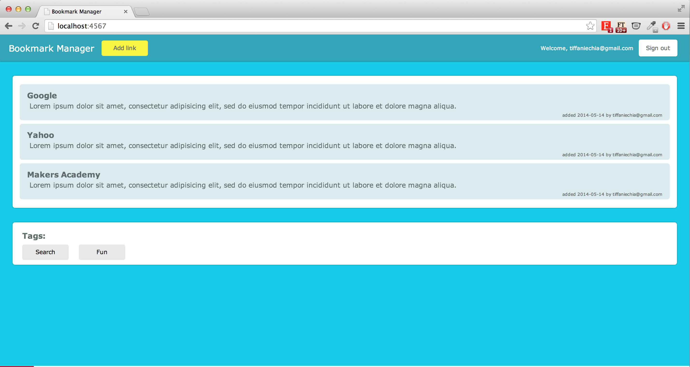
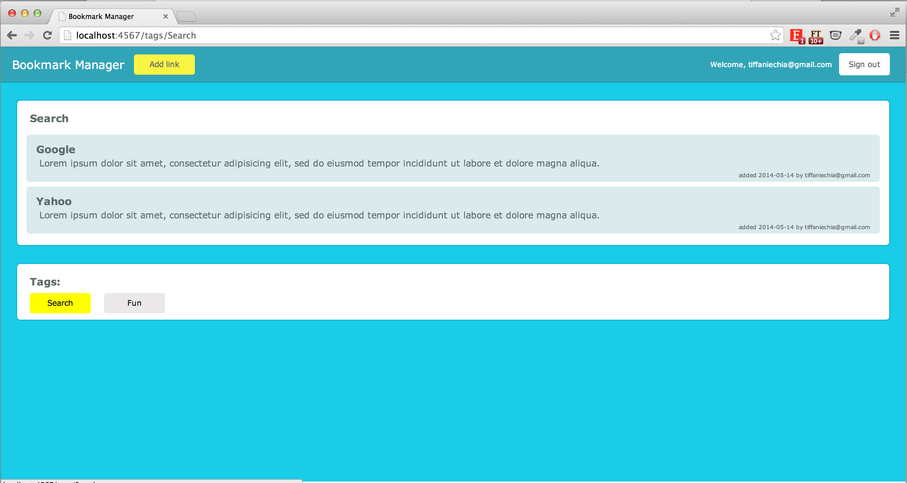
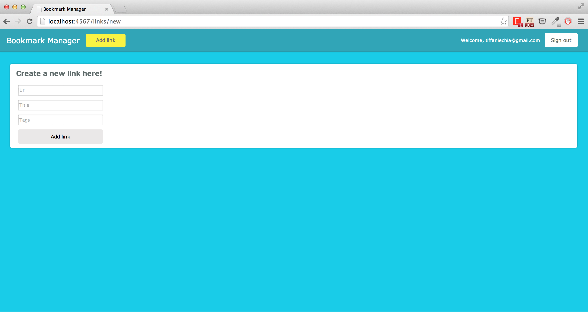
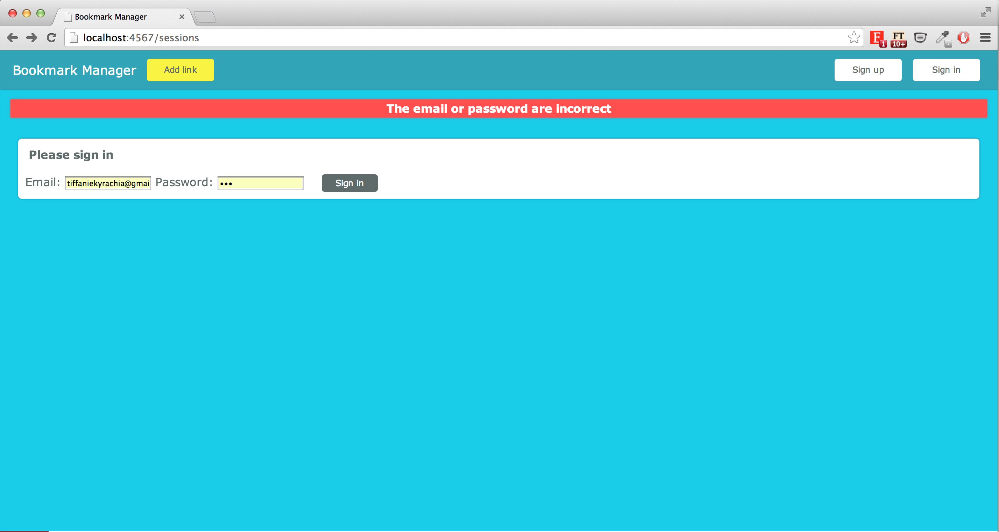

##Bookmark Manager

The goal of this task is to learn about Sinatra, Relational Databases, and Security via a Bookmark Manager  where users can keep a list of their favourite sites.
This Bookmark Manager will be similar to pineapple.io or delicious.com in spirit.

This app allows a user to add a favourite link with tags. Each post belongs to a user and is stamped as such. Each tag has many posts and therefore posts can be searched via tags.

A rudimentary security feature has been added via BCrypt as well.

This task was created by [Evgeny Shadchnev](https://github.com/shadchnev).

(Week 6)

##

###Home page with list of bookmarked links with the poster's details

###Search by tags

###Adding links

###Login page with error message

##Technologies Used
- Ruby
- Sinatra
- Postgresql
- Datamapper
- bcrypt-ruby
- HTML
- CSS
- Shotgun
- RSpec
- Capybara
- Database cleaner

##Moving forward:
The app should have the functionality to add a description instead of a stubbed one.
